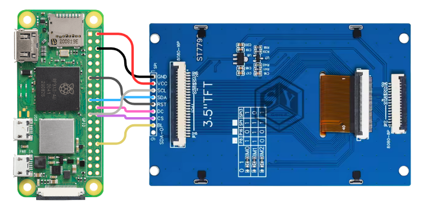

<h1 align=center>
    <p> Pi Weather Clock 🕐<p>
</h1>

<p align="center">
A dual-timezone world clock with live weather, running on Raspberry Pi Zero 2W with a 3.5" LCD.
</p>

<p align="center">
    
     
    
</p>

- Dual timezone display
- Live weather — temperature, humidity, and weather icon
- Weather updates via [Open-Meteo](https://open-meteo.com/) (no API key required)

## Hardware

### Wiring



| Pi Zero 2W | 3.5" ST7796S LCD |
|:----------:|:-----------:|
| 5V (Pin 2) | VCC |
| GND (Pin 6) | GND |
| GPIO10 / MOSI | SDA |
| GPIO11 / SCLK | SCL |
| GPIO8 / CE0 | CS |
| GPIO27 | RST |
| GPIO25 | DC |
| GPIO12 | BL |

## Software Requirements

### System packages

```bash
sudo apt update
sudo apt install \
  python3-pil \
  python3-tz \
  python3-requests \
  python3-spidev \
  python3-gpiozero \
  python3-numpy \
  fonts-noto-cjk \
  fonts-symbola
```

### Fonts

```bash
sudo mkdir -p /usr/share/fonts/truetype/custom
sudo wget -O /usr/share/fonts/truetype/custom/Orbitron-Bold.ttf "https://github.com/google/fonts/raw/main/ofl/orbitron/Orbitron%5Bwght%5D.ttf"
sudo wget -O /usr/share/fonts/truetype/custom/Rajdhani-Medium.ttf "https://github.com/google/fonts/raw/main/ofl/rajdhani/Rajdhani-Medium.ttf"
sudo fc-cache -f -v
```

## Configuration

Edit `config.py` to change timezones, weather locations, or display settings:

```python
# Upper / lower zone config (label + timezone + weather coordinates)
CLOCK_UPPER_ZONE = {
    "label": "Seattle",
    "tz": pytz.timezone("America/Los_Angeles"),
    "lat": 47.6745,
    "lon": -122.3184,
}

CLOCK_LOWER_ZONE = {
    "label": "Taiwan",
    "tz": pytz.timezone("Asia/Taipei"),
    "lat": 23.3354,
    "lon": 120.2439,
}
```

## Run

```bash
python main.py
```

To run on boot (recommended), use `systemd`:

```bash
sudo tee /etc/systemd/system/pi-weather-clock.service > /dev/null << 'EOF'
[Unit]
Description=Pi Weather Clock
After=network-online.target
Wants=network-online.target

[Service]
Type=simple
User=pi
WorkingDirectory=/home/pi/pi-weather-clock
ExecStart=/usr/bin/python3 /home/pi/pi-weather-clock/main.py
Restart=always
RestartSec=10

[Install]
WantedBy=multi-user.target
EOF

sudo systemctl daemon-reload
sudo systemctl enable --now pi-weather-clock.service
sudo systemctl status pi-weather-clock.service
```

## Weather Data

Powered by [Open-Meteo](https://open-meteo.com/) — free, no API key required.
